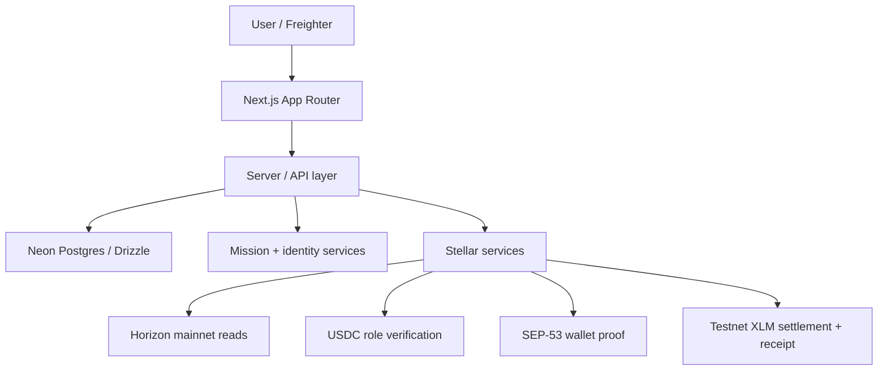

# Vicus

> **Where assets find their people.**
>
> **The community layer for tokenized assets.**

Vicus is a Stellar-first community and campaign layer for tokenized assets. It gives people a place to discover assets, understand what they represent, verify meaningful participation, complete proof-based missions, and build reputation around asset communities.

Vicus sits above the wallet. It is not an investment platform, brokerage, custody service, or financial adviser.

## Why Vicus

Tokenized assets can be technically real while remaining socially inert.

Wallets hold and send assets. RWA dashboards display them. Neither naturally creates community, education, contribution, identity, or issuer distribution.

Vicus adds that participation layer: source-backed context, watch-first discovery, privacy-safe role verification, proof-based missions, and an operational surface for reviewing contributions and campaign activity.

## Product loop

```text
Discover → Understand → Watch → Verify → Participate → Build reputation → Receive proof / eligible rewards
```

The product is intentionally watch-first: people can learn before connecting a wallet. The final reward step is part of the product direction, but live Stellar reward settlement is not shipped yet.

## What is live today

| Capability | Status | Current truth |
|---|---|---|
| Premium web product | ✅ Shipped | Next.js App Router surfaces for Explore, circles, passports, missions, profiles, and admin review. |
| Content and campaign data | ✅ Shipped | Neon Postgres and Drizzle-backed circles, Asset Passports, missions, profiles, and campaign records. |
| Stellar role verification | ✅ Shipped | Real Stellar mainnet USDC holder/trustline checks with privacy-safe results. |
| Proof-of-understanding missions | ✅ Shipped | Server-graded quiz configuration keeps correct answers off the client. |
| Manual mission review | ✅ Shipped | Text and research submissions support pending, approved, rejected, and needs-revision states. |
| Vicus reputation | ✅ Shipped | Approved participation points are derived from database state; they are not money or blockchain rewards. |
| Wallet authentication | ✅ Shipped | Freighter plus SEP-53 signed-message authentication creates secure wallet-backed sessions. |
| Authenticated participation | ✅ Shipped | Authenticated profiles, mission submissions, and admin review are session-backed. |
| Testnet native XLM reward settlement | 🟣 In progress | Real direct-payment and durable receipt path is implemented; manual testnet acceptance still needs a funded distributor and recipient account. |
| Mainnet payout, claimable balances, Soroban, CCTP, and cross-chain identity | ○ Roadmap | These remain safety-gated or future architecture and product work, not shipped functionality. |

## Stellar integration

Stellar is infrastructure in Vicus, not decoration:

- **Mainnet reads:** the server reads Stellar account data through Horizon for the live verification path.
- **USDC role verification:** a canonical USDC trustline with a positive balance can produce `Verified holder`; a matching trustline without a positive balance can produce `Verified trustline`.
- **Privacy-safe output:** the API returns a role, reason, asset/network context, and timestamp—not an exact balance, portfolio, or issuer account.
- **Freighter:** Stellar Wallets Kit discovers the wallet and Freighter signs the authentication message on Stellar mainnet.
- **SEP-53 authentication:** Vicus verifies a short-lived signed message, not a transaction. Login requires no XLM and creates no Horizon transaction.
- **Testnet settlement:** approved reward-enabled missions can send native XLM from a dedicated server-side distributor and persist the real transaction receipt. The default path is Stellar Testnet; Testnet XLM has no monetary value.
- **Safety boundary:** public-network rewards require `VICUS_ENABLE_MAINNET_REWARDS=true`; USDC rewards, claimable balances, Soroban vaults, and treasury operations remain roadmap work.

## Architecture



The current server boundary keeps database access, role rules, authentication verification, distributor signing, and sensitive configuration on the server. Mainnet settlement is explicitly safety-gated.

For a compact engineering map, see [`docs/ARCHITECTURE.md`](docs/ARCHITECTURE.md).

## Core product surfaces

- **Explore** — browse circles without a wallet.
- **Asset Circles** — an asset-native home for context, watch mode, verification, and missions.
- **Asset Passport** — source-linked asset identity, intended use, eligibility, and risk/disclosure context.
- **Missions** — proof-of-understanding quizzes and reviewed text/research contributions.
- **Profile** — authenticated participation history, derived points, and contribution records.
- **Issuer/Admin dashboard** — campaign-backed mission data and authenticated submission review. Full issuer onboarding and campaign funding are roadmap items.

## Verification philosophy

Vicus is explicit about what each proof means:

- A **pasted address** is a read-only blockchain lookup. It is not proof that the visitor controls the address.
- A **signed wallet message** is proof of control of the selected Stellar address. It is not proof of a balance, asset holding, or multisig authority.
- Exact balances and unrelated portfolio data are never exposed publicly by the role-verification path.
- Vicus does not invent asset ownership, approvals, rewards, or transaction hashes.
- Eligibility, approval, claim creation, submission, and confirmation are separate states when reward settlement exists.
- Roadmap functionality is labelled as roadmap rather than presented as live.

## Tech stack

Only the packages used by the current implementation are listed here:

- Next.js 16.3.8 and React 19.2.8
- TypeScript 5
- Tailwind CSS v4
- Neon Postgres via `@neondatabase/serverless`
- Drizzle ORM and Drizzle Kit
- Stellar SDK via `@stellar/stellar-sdk`
- Stellar Wallets Kit via `@creit.tech/stellar-wallets-kit`
- Freighter API via `@stellar/freighter-api`

## Local development

```bash
npm install
cp .env.example .env.local
```

On PowerShell, the equivalent is `Copy-Item .env.example .env.local`.

Configure these server-side values in `.env.local`:

```text
DATABASE_URL
VICUS_APP_URL
VICUS_HOME_DOMAIN
VICUS_ADMIN_WALLET_ADDRESSES
VICUS_REWARD_NETWORK
VICUS_REWARD_DISTRIBUTOR_SECRET
VICUS_REWARD_MAX_XLM
VICUS_ENABLE_MAINNET_REWARDS
```

The current auth implementation binds SEP-53 messages through `VICUS_HOME_DOMAIN`; it does not require a separate `VICUS_WEB_AUTH_DOMAIN` setting. Reward distributor secrets are server-only and must never be prefixed with `NEXT_PUBLIC_`. Never commit `.env.local` or real credentials.

Initialize the database with the deterministic development seed:

```bash
npm run db:migrate
npm run db:seed
npm run db:verify
```

Start the app:

```bash
npm run dev
```

## Verification commands

```bash
npm run lint
npx tsc --noEmit
npm run build
npm run db:verify
npm run mission:verify
npm run auth:verify
npm run reward:verify
```

The database, mission, auth, and reward verification scripts exercise the implemented Neon-backed flows. `reward:verify` uses isolated temporary records and settlement fakes; it does not present mocked activity as blockchain state. Real testnet settlement requires the manual distributor setup documented in Slice 5B.

## Product documentation

- [Product idea](docs/Vicus_Product_Idea.md)
- [PRD, build plan, and architecture](docs/Vicus_PRD_Build_Plan_Architecture.md)
- [Brand messaging](docs/Vicus_Brand_Messaging.md)
- [Design system](docs/DESIGN.md)
- [Current architecture map](docs/ARCHITECTURE.md)
- [Slice 3 — Stellar verification](docs/Vicus_Slice_3_Stellar_Verification.md)
- [Slice 4 — Missions](docs/Vicus_Slice_4_Missions.md)
- [Slice 5A — Authentication](docs/Vicus_Slice_5A_Auth.md)
- [Slice 5B — XLM rewards](docs/Vicus_Slice_5B_Rewards.md)

## Roadmap

- Mainnet Stellar reward settlement and broader receipt operations
- Issuer campaign funding and onboarding
- Richer asset communities and contribution surfaces
- Cross-chain identity
- CCTP-funded campaigns

These are planned directions, not current product claims.

## Hackathon

Built for **Find Your Way: Hackathon** as a Stellar-first project.
