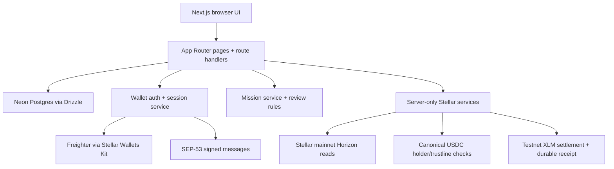

# Vicus architecture

This document describes the current implementation only. A Stellar Testnet native-XLM settlement path is live in code; mainnet settlement, claimable balances, Soroban vaults, CCTP, cross-chain identity, and full issuer onboarding remain roadmap or safety-gated work.

## System map



## Frontend

The Next.js App Router provides the user-facing surfaces:

- `/` — product entry point
- `/explore` — watch-first circle discovery
- `/circles/[slug]` — circle, Asset Passport summary, verification, and mission context
- `/missions/[id]` — quiz or text/research submission experience
- `/profile/me` — authenticated profile and contribution history
- `/admin` — authenticated admin review queue

The browser renders privacy-safe responses. Application JavaScript does not receive quiz answer keys, database credentials, admin signing keys, exact role-check balances, or raw session tokens; the session token is delivered only in an HttpOnly cookie.

## Server and API boundaries

Route handlers keep data access and security-sensitive decisions on the server:

- `POST /api/stellar/verify-role` performs the read-only Stellar role check.
- `POST /api/auth/stellar/challenge` issues a short-lived canonical message.
- `POST /api/auth/stellar/verify` verifies the SEP-53 signature and creates a session.
- `GET /api/auth/session` and `POST /api/auth/logout` manage the current session.
- `GET /api/profile/me` loads the authenticated profile.
- `POST /api/missions/[id]/submit` validates and records a mission submission.
- `POST /api/admin/submissions/[id]/review` applies an authenticated admin review transition.
- `GET /api/rewards/me` loads the current user's eligible and claimed rewards.
- `POST /api/rewards/submissions/[id]/claim` derives the reward from the approved submission and submits native XLM when configured.

Server-only modules under `src/lib/` contain the auth, mission, data-access, and Stellar rules. The server reads canonical asset verification configuration from the database rather than accepting an issuer from the browser.

## Data layer

Neon Postgres is accessed through `@neondatabase/serverless` and Drizzle ORM. Migrations live in `drizzle/`; the deterministic seed and verification scripts live in `scripts/`.

The current schema covers:

- users, Stellar wallets, auth challenges, and hashed auth sessions
- assets and circles, including source, eligibility, and disclosure fields
- campaign records and mission definitions
- mission submissions, review state, evidence URLs, and reviewer metadata
- circle memberships and badges
- reward claims with durable status, transaction proof, network, destination, and recovery metadata

Approved Vicus points are derived from approved mission submissions and remain offchain participation data. Reward claims are separate from points and only cover native XLM in the configured reward network.

## Mission system

Mission configuration is held server-side. The browser receives quiz prompts and choices without the correct answer. The server validates payload shape, availability, duplicate policy, evidence URLs, and review transitions.

The shipped paths are:

- proof-of-understanding quiz: auto-graded to `approved` or `needs_revision`
- text/research contribution: `pending`, then admin `approved`, `rejected`, or `needs_revision`

A live submission requires an authenticated wallet session. Approval awards derived Vicus points and makes an XLM reward-enabled mission eligible; settlement still requires an explicit user claim and a configured server-side distributor.

## Authentication and sessions

1. Stellar Wallets Kit discovers Freighter and requires Stellar mainnet.
2. The server issues a short-lived deterministic message containing the address, network, domain, nonce, and expiry.
3. Freighter signs the message with SEP-53 `signMessage`; no transaction is built or submitted.
4. The server reconstructs the exact message, verifies the signature and signer, consumes the challenge, and links the public key to a user.
5. A random session token is returned only in an HttpOnly, SameSite cookie. The database stores a hash of the token, not the raw token.

A signed message proves control of the selected signing key. It does not establish asset ownership or balance; that remains a separate read-only role check.

## Stellar verification

`src/lib/stellar/` is server-only. The live path uses a bounded Horizon mainnet client and a canonical USDC asset configuration. The role service returns only:

- `verified-holder`
- `verified-trustline`
- `not-qualified`
- `invalid-address`
- `account-not-found`
- `verification-unavailable`
- `unsupported`

Pasted addresses are not persisted or logged by this path. Exact balances, unrelated assets, issuer accounts, and wallet-ownership claims are not returned. Unsupported or deferred assets remain learn/watch-only.

## Reward settlement

The reward service supports native XLM only. It selects a configured Testnet or public-network Horizon endpoint, verifies the destination account exists, loads the distributor sequence, builds and signs a normal payment server-side, persists the signed envelope and transaction hash, submits the transaction, and stores confirmation metadata.

The current default is Stellar Testnet. Public-network settlement is rejected unless `VICUS_ENABLE_MAINNET_REWARDS=true`. USDC rewards, claimable balances, Soroban, and issuer treasury funding are not part of this slice.

## Security boundaries

- Environment variables are server-only; `.env.local` is ignored.
- Browser payloads cannot choose the user ID, mission points, quiz score, review status, or reviewer.
- Admin review requires an authenticated user with the admin role.
- Auth challenges expire, are consumed, and have bounded verification attempts.
- Session cookies are HttpOnly and SameSite; sessions are revocable and stored by hash.
- The browser never holds a payment or admin signing key.
- The reward distributor secret is server-only, never persisted, and never returned to the browser.
- The browser cannot choose reward amount, asset, network, or destination.
- The current route submits only configured native-XLM payments; no claimable balance or Soroban route exists.

## Local verification

```bash
npm run db:migrate
npm run db:verify
npm run mission:verify
npm run auth:verify
npm run reward:verify
npm run lint
npx tsc --noEmit
npm run build
```
